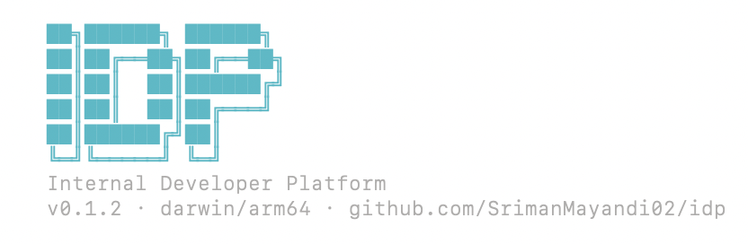

# idp

> A demo of a globally-installable Go CLI. When you run `idp`, it prints a cyan ASCII "IDP" banner along with version, OS/architecture, and the repo URL. The point of this project is to demonstrate a real, cross-platform, one-command global install pipeline (GoReleaser → GitHub Releases → Homebrew → Docker → curl).

[](https://github.com/SrimanMayandi02/idp/releases/latest)
[](LICENSE)

## Quick install

Pick the line that matches your platform and paste it into your terminal.

| Platform | Command |
|---|---|
| macOS / Linux (Homebrew) | `brew install SrimanMayandi02/tap/idp` |
| Linux / macOS (curl) | `curl -fsSL https://raw.githubusercontent.com/SrimanMayandi02/idp/main/install.sh \| sh` |
| Any OS (Go) | `go install github.com/SrimanMayandi02/idp@latest` |
| Any OS (Docker, no install) | `docker run --rm ghcr.io/srimanmayandi02/idp` |
| Windows | [Download the latest .zip](https://github.com/SrimanMayandi02/idp/releases/latest) |

After install, run:

```bash
idp
```

You should see the cyan IDP banner.

---

## Detailed install instructions

### Option 1 — Homebrew (recommended for macOS and Linux)

The easiest way to install and stay up-to-date on macOS, and on Linux via Linuxbrew.

**Install:**

```bash
brew install SrimanMayandi02/tap/idp
```

**Verify:**

```bash
idp
```

**Upgrade later:**

```bash
brew update
brew upgrade idp
```

**Uninstall:**

```bash
brew uninstall idp
brew untap SrimanMayandi02/tap
```

**Requirements:** Homebrew installed. If you don't have it:

```bash
/bin/bash -c "$(curl -fsSL https://raw.githubusercontent.com/Homebrew/install/HEAD/install.sh)"
```

---

### Option 2 — curl one-liner (macOS and Linux)

For users who don't want Homebrew, or who are scripting an install into a Dockerfile or CI runner. The script auto-detects your OS and architecture and downloads the right binary from GitHub Releases.

**Install the latest version:**

```bash
curl -fsSL https://raw.githubusercontent.com/SrimanMayandi02/idp/main/install.sh | sh
```

**Install a specific version:**

```bash
IDP_VERSION=v0.1.2 curl -fsSL https://raw.githubusercontent.com/SrimanMayandi02/idp/main/install.sh | sh
```

**Install to a custom location** (default is `/usr/local/bin`):

```bash
INSTALL_DIR=$HOME/.local/bin curl -fsSL https://raw.githubusercontent.com/SrimanMayandi02/idp/main/install.sh | sh
```

**Verify:**

```bash
idp
```

**Uninstall:**

```bash
sudo rm /usr/local/bin/idp
```

**Requirements:** `curl`, `tar`, and write access to `/usr/local/bin` (or use `INSTALL_DIR` to point elsewhere).

---

### Option 3 — `go install` (any platform with Go)

If you have Go 1.21+ installed, this is the simplest cross-platform install — works the same on macOS, Linux, and Windows.

**Install:**

```bash
go install github.com/SrimanMayandi02/idp@latest
```

The binary is placed at `$(go env GOPATH)/bin/idp`. Make sure that folder is in your `$PATH`:

```bash
export PATH="$(go env GOPATH)/bin:$PATH"
```

To make it permanent, add that line to your shell config (`~/.zshrc`, `~/.bashrc`, etc.).

**Verify:**

```bash
idp
```

> **Note:** Binaries built via `go install` show `vdev` instead of a real version number because `go install` builds from source and doesn't apply GoReleaser's build-time version injection. The functionality is identical.

**Uninstall:**

```bash
rm $(go env GOPATH)/bin/idp
```

**Requirements:** Go 1.21 or later. Install from [https://go.dev/dl/](https://go.dev/dl/).

---

### Option 4 — Docker (any platform, zero install)

Run the binary inside a container without installing anything on your host.

**Run latest:**

```bash
docker run --rm ghcr.io/srimanmayandi02/idp
```

**Run a specific version:**

```bash
docker run --rm ghcr.io/srimanmayandi02/idp:0.1.2
```

**On Apple Silicon Macs (M1/M2/M3),** you may see a platform mismatch warning because the image is `linux/amd64` and runs under Rosetta emulation. To suppress the warning:

```bash
docker run --rm --platform=linux/amd64 ghcr.io/srimanmayandi02/idp
```

**Pull without running** (cache the image for offline use):

```bash
docker pull ghcr.io/srimanmayandi02/idp
```

**Remove the cached image:**

```bash
docker rmi ghcr.io/srimanmayandi02/idp
```

**Requirements:** Docker installed. Get it from [https://www.docker.com/get-started](https://www.docker.com/get-started).

---

### Option 5 — Direct binary download (Windows, Linux, macOS)

The manual install path. Especially useful for Windows users without Go or Docker, and for air-gapped environments.

**Step 1 — Find your platform's archive:**

| OS | Architecture | Filename |
|---|---|---|
| macOS | Intel | `idp_0.1.2_darwin_amd64.tar.gz` |
| macOS | Apple Silicon | `idp_0.1.2_darwin_arm64.tar.gz` |
| Linux | x86_64 | `idp_0.1.2_linux_amd64.tar.gz` |
| Linux | ARM64 | `idp_0.1.2_linux_arm64.tar.gz` |
| Windows | x86_64 | `idp_0.1.2_windows_amd64.zip` |
| Windows | ARM64 | `idp_0.1.2_windows_arm64.zip` |

**Step 2 — Download:**

Go to the [latest release page](https://github.com/SrimanMayandi02/idp/releases/latest) and download the archive for your platform.

**Step 3 — Extract and install:**

#### On macOS / Linux

```bash
tar -xzf idp_0.1.2_*.tar.gz
sudo mv idp /usr/local/bin/
idp
```

#### On Windows (PowerShell)

```powershell
# Extract the zip
Expand-Archive -Path .\idp_0.1.2_windows_amd64.zip -DestinationPath .

# Run it (this session only)
.\idp.exe
```

To make `idp` available in any PowerShell window:

```powershell
# Move the binary to a permanent folder
New-Item -ItemType Directory -Force -Path "$env:LOCALAPPDATA\Programs\idp"
Move-Item -Force .\idp.exe "$env:LOCALAPPDATA\Programs\idp\idp.exe"

# Add the folder to your user PATH (one-time)
[Environment]::SetEnvironmentVariable(
    "Path",
    [Environment]::GetEnvironmentVariable("Path", "User") + ";$env:LOCALAPPDATA\Programs\idp",
    "User"
)
```

Restart PowerShell, then:

```powershell
idp
```

#### On Windows (Command Prompt / cmd.exe)

Use File Explorer to extract the zip, then double-click `idp.exe` to run, or move it to a folder on your `%PATH%` (e.g. `C:\Windows\System32\` — though a dedicated folder is cleaner).

---

## Platform support matrix

| Platform | brew | curl | go install | Docker | direct download |
|---|---|---|---|---|---|
| macOS Intel | ✅ | ✅ | ✅ | ✅ | ✅ |
| macOS Apple Silicon | ✅ | ✅ | ✅ | ✅ | ✅ |
| Linux x86_64 (Ubuntu, Debian, RHEL, Amazon Linux, Alpine, etc.) | ✅ (Linuxbrew) | ✅ | ✅ | ✅ | ✅ |
| Linux ARM64 (Raspberry Pi, AWS Graviton, etc.) | ✅ (Linuxbrew) | ✅ | ✅ | ✅ | ✅ |
| Windows x86_64 | ❌ | ❌ | ✅ | ✅ | ✅ |
| Windows ARM64 | ❌ | ❌ | ✅ | ✅ | ✅ |
| WSL2 on Windows | ✅ | ✅ | ✅ | ✅ | ✅ |

---

## Verify the install

After installing via any of the methods above, run:

```bash
idp
```

You should see a cyan ASCII "IDP" banner showing:

- The project name in big block letters
- "Internal Developer Platform"
- The version, your OS/arch, and a link to this repo

---

## Troubleshooting

**`brew install` says "older version installed" or "formula not found"**

Refresh the tap:

```bash
brew untap SrimanMayandi02/tap
brew install SrimanMayandi02/tap/idp
```

**`idp: command not found` after installing**

Your install path probably isn't on `$PATH`. Check where the binary lives:

```bash
which idp
```

If you used `go install`, add the Go bin folder:

```bash
export PATH="$(go env GOPATH)/bin:$PATH"
```

If you used direct download, make sure you moved the binary into a folder on your `$PATH` (like `/usr/local/bin/`).

**Banner shows `vdev` instead of a real version**

You installed via `go install`, which builds from source and skips the build-time version injection. Functionality is the same. If you want the real version string in the banner, install via Homebrew, curl, Docker, or direct download.

**Docker says "platform mismatch" on Apple Silicon**

That's expected — the image is `linux/amd64`, your Mac is `arm64`. It runs fine under Rosetta. Add `--platform=linux/amd64` to silence the warning.

**Permission denied when installing to `/usr/local/bin/`**

Either run with `sudo`, or install to a folder you own:

```bash
INSTALL_DIR=$HOME/.local/bin curl -fsSL https://raw.githubusercontent.com/SrimanMayandi02/idp/main/install.sh | sh
```

Then make sure `~/.local/bin` is on your `$PATH`.

---

## License

MIT — see [LICENSE](LICENSE).